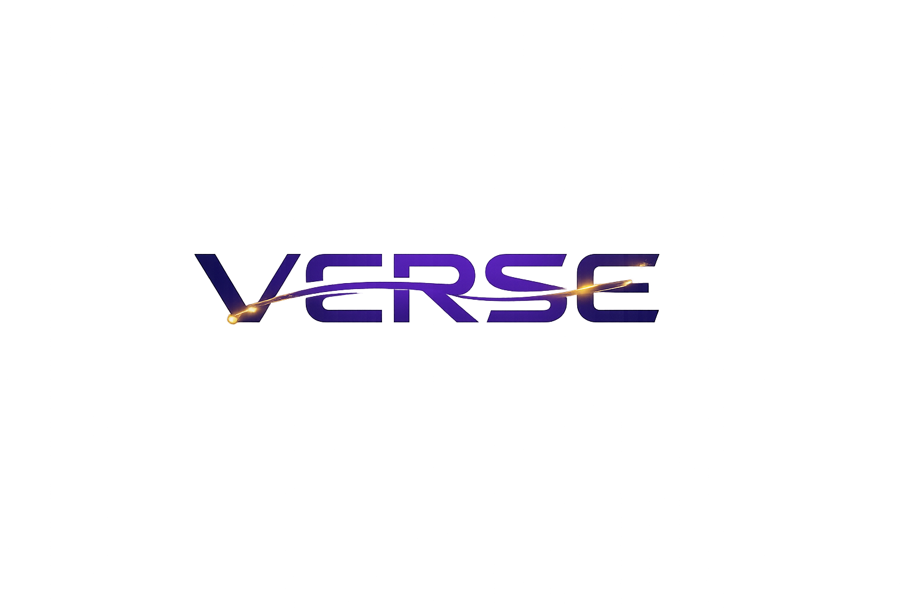

# VERSE
### Visual & Explainable Reasoning for Semantic Evolution

> **AI-Powered Semantic Continuity and Production Intelligence for Intelligent Filmmaking**
>
> *"Every story lives in its own VERSE."*

# VERSE

<p align="center">
  
</p>

<h3 align="center">Visual & Explainable Reasoning for Semantic Evolution</h3>

<p align="center">
  <strong>AI-Powered Semantic Continuity and Production Intelligence for Intelligent Filmmaking</strong>
</p>

<p align="center">
  <em>"Every story lives in its own VERSE."</em>
</p>
---

# 🎬 Problem Statement

Script supervisors and film production teams need a reliable way to maintain visual and narrative continuity across non-linear productions because production knowledge is fragmented across departments, continuity verification relies heavily on human memory, and existing production software and AI systems lack a persistent semantic understanding of the evolving state of a film.

Modern filmmaking rarely follows the order of the screenplay. Scenes are filmed based on actor availability, locations, budgets, and production logistics, making continuity management one of the most challenging aspects of production.

Current workflows rely heavily on manual notes, production photos, and human memory, resulting in:

- Fragmented production knowledge across departments
- Time-consuming manual continuity verification
- Increased risk of continuity errors
- Expensive re-shoots and post-production fixes
- Limited collaboration between production teams

Although many production management tools exist, they primarily focus on scheduling and asset management rather than understanding the evolving semantic state of a film. There remains a significant gap for an intelligent AI assistant capable of tracking characters, props, wardrobe, locations, and narrative progression throughout production.

---

# 💡 Solution Description

**VERSE (Visual & Explainable Reasoning for Semantic Evolution)** is an AI-powered continuity intelligence platform designed to help script supervisors and production teams maintain visual and narrative consistency throughout non-linear film productions.

Rather than replacing creative professionals, VERSE serves as an intelligent production assistant that acts as a **persistent semantic production memory**, continuously understanding how characters, scenes, props, costumes, and locations evolve across the entire production.

Core capabilities include:

- 📖 **Screenplay Understanding** – Automatically extracts structured information such as scenes, characters, props, wardrobe, locations, and timelines from screenplay documents.
- 🧠 **Semantic Production Memory** – Maintains contextual relationships between production elements across filming, allowing AI to remember evolving production states.
- 🎥 **Continuity Intelligence** – Detects inconsistencies in wardrobe, props, narrative progression, scene sequencing, and production updates before filming.
- 🔍 **Explainable AI Recommendations** – Provides transparent explanations, confidence scores, and actionable recommendations instead of black-box AI decisions.
- 🤝 **Collaborative Dashboard** – Enables directors, script supervisors, producers, and other departments to access shared continuity insights from a centralized interface.

By combining semantic reasoning with explainable AI, VERSE improves collaboration, reduces cognitive workload, minimizes costly continuity mistakes, and enhances overall production efficiency.

---

# 🤖 AI Approach and Architecture

VERSE adopts a **Human-Centered Explainable AI (XAI)** architecture that combines Large Language Models (LLMs), semantic reasoning, knowledge graphs, and persistent contextual memory to support continuity management.

## AI Workflow

```text
Screenplay Input
        │
        ▼
Screenplay Understanding
        │
        ▼
Semantic Information Extraction
        │
        ▼
Semantic Production Memory
        │
        ▼
Knowledge Graph Construction
        │
        ▼
Continuity Intelligence Engine
        │
        ▼
Explainable AI Reasoning
        │
        ▼
Collaborative Dashboard
```

### Key AI Components

#### 📖 Screenplay Understanding Engine

Uses IBM Granite LLMs to analyze screenplay documents and extract structured production knowledge including:

- Characters
- Locations
- Dialogue
- Props
- Wardrobe
- Scene metadata
- Narrative timelines

---

#### 🧠 Semantic Production Memory

Unlike traditional production software, VERSE continuously stores and updates relationships between:

- Characters
- Scenes
- Wardrobe
- Props
- Locations
- Narrative progression
- Production history

This enables persistent contextual reasoning throughout filming.

---

#### 🎬 Continuity Intelligence Engine

Automatically detects continuity inconsistencies involving:

- Costume changes
- Prop placement
- Character positioning
- Narrative sequencing
- Environmental consistency
- Production revisions

---

#### 🔍 Explainable AI

Rather than producing opaque AI outputs, VERSE explains:

- What continuity issue was detected
- Why it occurred
- Which screenplay elements were analyzed
- Confidence score
- Recommended corrective action

---

#### 🤝 Human-in-the-Loop

VERSE is designed to assist—not replace—creative professionals.

```text
Human Input
      │
      ▼
AI Analysis
      │
      ▼
Continuity Recommendation
      │
      ▼
Human Verification
      │
      ▼
Final Production Decision
```

Script supervisors and production teams always retain final creative authority.

---

# 🏆 Selected Challenge Theme

## AI for Creative Industries and Human-AI Collaboration

VERSE demonstrates how Artificial Intelligence can responsibly enhance creative workflows within the film industry.

Instead of generating creative content, VERSE augments filmmaking professionals by providing intelligent continuity assistance through semantic reasoning and explainable AI.

The project aligns with three key principles:

- 🎭 **AI for Creative Industries** – Supporting filmmaking workflows through intelligent production assistance.
- 🤝 **Human-Centered AI** – Keeping humans in control through Human-in-the-Loop decision-making.
- 🔍 **Explainable AI** – Delivering transparent recommendations that production teams can understand and verify.

VERSE showcases how AI can empower creative professionals while preserving artistic control and human expertise.

---

# 🚀 How IBM Bob Was Used

IBM Bob played an important role throughout the design and development process of VERSE as an **AI-powered innovation assistant**.

Although IBM Bob is **not embedded in the final product**, it significantly contributed during the project's Design Thinking process by helping the team refine ideas, validate concepts, and explore AI-driven solutions.

IBM Bob was used for:

### 💡 Problem Framing

- Identifying continuity management challenges
- Exploring filmmaking workflow pain points
- Refining the project's final problem statement

### 🧩 Solution Ideation

- Brainstorming AI-powered continuity features
- Refining MVP functionality
- Exploring Human-AI collaboration strategies

### 🏗 AI Architecture Planning

- Validating semantic production memory concepts
- Designing Explainable AI workflows
- Exploring knowledge graph integration
- Planning Human-in-the-Loop architecture

### ☁ IBM Technology Exploration

IBM Bob helped evaluate how IBM technologies could support the platform, including:

- IBM watsonx
- IBM Granite Models
- Explainable AI
- Enterprise AI workflows

These explorations informed the final AI architecture adopted by VERSE.

### 📈 Prototype Refinement

IBM Bob also supported:

- MVP planning
- Feature prioritization
- Rapid prototyping
- Implementation roadmap refinement
- User testing preparation

---

## IBM AI Technologies Used

| IBM Technology | Purpose |
|----------------|---------|
| **IBM watsonx** | AI orchestration, workflow management, semantic processing |
| **IBM Granite** | Screenplay understanding, semantic reasoning, continuity analysis |
| **IBM Bob** | Problem framing, ideation, architecture planning, and solution refinement |

Together, IBM's AI ecosystem enabled the team to design a trustworthy, explainable, and human-centered AI solution for intelligent filmmaking.

---

# 🌟 Vision

VERSE aims to become the intelligent semantic production memory for the filmmaking industry—helping production teams maintain continuity, reduce costly errors, and collaborate more effectively through responsible, explainable, and human-centered AI.

